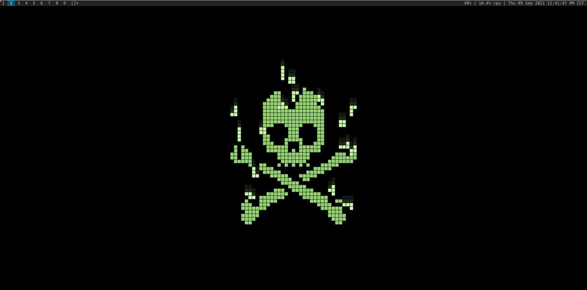

# dwm

This is my customized version of the dynamic window manager (dwm) by suckless.org , this dwm is patched with various patched offered by suckless tools.
The dwm also uses some scripts written by me. After download, in order to get the scripts to work kindly edit their complete path in the config.h file.
If you have any suggestions, you can contact me on either Discord or Twitter.

## Screenshots

